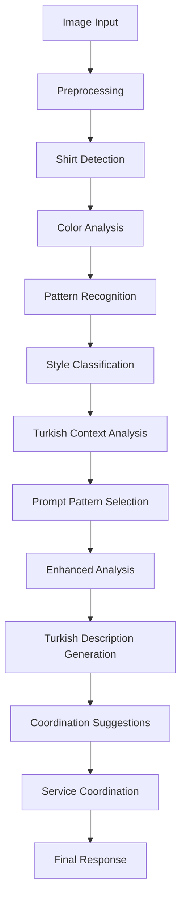
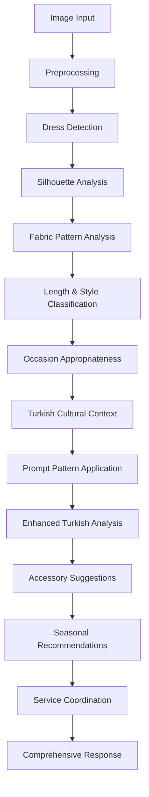
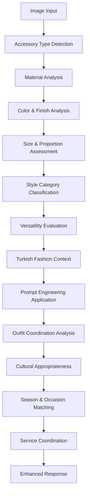
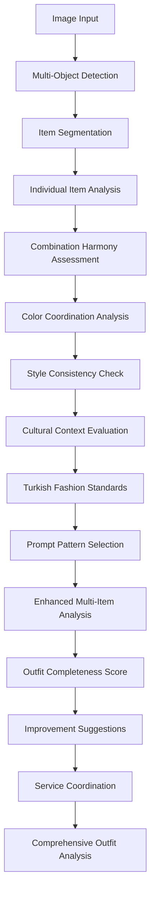

# 🚀 AURA AI - Enhanced Image Processing Service
# Computer Vision & AI Engineer: Flow Schemas & Fine-Tuning Plans

## 📋 SERVICE OVERVIEW

**Enhanced Image Processing Service v8.0.0**
- **Port**: 8002
- **Core Technology**: FastAPI + PyTorch + CLIP + Detectron2
- **Special Features**: Turkish Fashion Analysis + 4 Prompt Engineering Patterns
- **Service Coordination**: Multi-service AURA AI ecosystem integration

## 🎯 4 ADVANCED PROMPT ENGINEERING PATTERNS

### 1. 🎭 PERSONA PATTERN
```
Role: Expert Turkish Fashion Consultant
Expertise: 15+ years in Turkish fashion industry
Specialties: Cultural context, modern trends, traditional elements
Approach: Personalized, culturally-aware, trend-conscious analysis
```

### 2. 📝 RECIPE PATTERN
```
Step 1: Image Quality Assessment
Step 2: Item Detection & Categorization
Step 3: Color Analysis & Palette Extraction
Step 4: Style Classification (Turkish Context)
Step 5: Cultural Relevance Evaluation
Step 6: Coordination Recommendations
Step 7: Final Confidence Scoring
```

### 3. 📄 TEMPLATE PATTERN
```
FASHION ITEM ANALYSIS TEMPLATE:
├── Basic Information
│   ├── Category: [shirt/dress/accessory/etc.]
│   ├── Primary Colors: [color analysis]
│   └── Pattern Type: [solid/striped/floral/etc.]
├── Style Analysis
│   ├── Style Category: [casual/formal/business/etc.]
│   ├── Turkish Context: [modern/traditional/fusion]
│   └── Trend Alignment: [current/classic/emerging]
├── Cultural Relevance
│   ├── Turkish Fashion Compatibility: [high/medium/low]
│   ├── Seasonal Appropriateness: [spring/summer/fall/winter]
│   └── Occasion Suitability: [daily/work/special/etc.]
└── Coordination Potential
    ├── Versatility Score: [1-10]
    ├── Color Coordination: [complementary colors]
    └── Style Matching: [compatible styles]
```

### 4. 🧠 CONTEXT & INSTRUCTION PATTERN
```
CONTEXT: Turkish fashion market, cultural preferences, seasonal trends
USER PROFILE: Style preferences, wardrobe needs, cultural background
CURRENT TRENDS: 2024 Turkish fashion, international influences
INSTRUCTION: Analyze with cultural sensitivity, provide Turkish descriptions,
consider local fashion context, suggest appropriate combinations
```

## 🔄 FLOW SCHEMAS FOR 4 SCENARIOS

### SCENARIO 1: Single Shirt Analysis 👕


**Processing Steps:**
1. **Image Preprocessing**: Resize, normalize, enhance quality
2. **Shirt Detection**: YOLO/Detectron2 object detection
3. **Color Analysis**: Dominant color extraction, palette generation
4. **Pattern Recognition**: Solid, striped, checkered, printed patterns
5. **Style Classification**: Casual, formal, business, sport
6. **Turkish Context**: Cultural appropriateness, local trends
7. **Prompt Engineering**: Apply selected pattern (persona/recipe/template/context)
8. **Enhancement**: Turkish vocabulary, cultural nuances
9. **Coordination**: Color matching, style compatibility
10. **Service Integration**: Style profile, combination engine coordination

### SCENARIO 2: Single Dress Analysis 👗


**Processing Steps:**
1. **Image Quality Check**: Resolution, lighting, clarity assessment
2. **Dress Detection**: Full garment boundary detection
3. **Silhouette Analysis**: A-line, straight, fit-and-flare, etc.
4. **Length Classification**: Mini, midi, maxi, knee-length
5. **Pattern & Texture**: Fabric pattern, texture recognition
6. **Style Category**: Casual, cocktail, evening, business
7. **Cultural Context**: Turkish modest fashion, cultural appropriateness
8. **Occasion Analysis**: Daily, work, special events, religious occasions
9. **Color Harmony**: Seasonal color analysis, skin tone compatibility
10. **Enhancement**: Turkish fashion terminology, cultural insights

### SCENARIO 3: Accessory Analysis 👜


**Accessory Categories:**
- **Bags**: Handbag, clutch, backpack, tote
- **Jewelry**: Necklace, earrings, bracelet, ring
- **Shoes**: Heels, flats, boots, sneakers
- **Others**: Scarves, belts, hats, watches

### SCENARIO 4: Multi-Item Analysis 👕👗👜


**Multi-Item Processing:**
1. **Object Detection**: Identify all fashion items in image
2. **Segmentation**: Separate each item for individual analysis
3. **Item Classification**: Categorize each detected item
4. **Color Harmony**: Check color coordination between items
5. **Style Consistency**: Evaluate style compatibility
6. **Proportion Analysis**: Check size and proportion balance
7. **Occasion Appropriateness**: Assess outfit suitability
8. **Cultural Context**: Turkish fashion standards compliance
9. **Completeness Score**: Rate outfit completeness
10. **Enhancement Suggestions**: Recommend improvements or additions

## 🎨 TURKISH FASHION OPTIMIZATION

### Cultural Context Features:
- **Traditional Elements**: Turkish patterns, motifs, colors
- **Modern Turkish Fashion**: Contemporary trends in Turkey
- **Modest Fashion**: Hijab-friendly styling, coverage considerations
- **Seasonal Preferences**: Turkish climate-appropriate recommendations
- **Local Brand Recognition**: Turkish fashion brand awareness
- **Cultural Events**: Ramadan, Eid, wedding-appropriate styling

### Turkish Vocabulary Integration:
```python
TURKISH_FASHION_TERMS = {
    "colors": {
        "kırmızı": "red", "mavi": "blue", "yeşil": "green",
        "sarı": "yellow", "mor": "purple", "pembe": "pink",
        "turuncu": "orange", "kahverengi": "brown"
    },
    "styles": {
        "günlük": "casual", "resmi": "formal", "spor": "sport",
        "şık": "elegant", "modern": "modern", "klasik": "classic"
    },
    "items": {
        "gömlek": "shirt", "elbise": "dress", "pantolon": "pants",
        "çanta": "bag", "ayakkabı": "shoes", "takı": "jewelry"
    }
}
```

## 🔧 FINE-TUNING IMPLEMENTATION PLAN

### Phase 1: Data Collection & Preparation
```python
# 1. Turkish Fashion Dataset Creation
DATASET_STRUCTURE = {
    "training_images": 10000,  # Turkish fashion images
    "validation_images": 2000,
    "test_images": 1000,
    "categories": [
        "traditional_turkish_wear",
        "modern_turkish_fashion", 
        "modest_fashion",
        "seasonal_wear",
        "occasion_specific"
    ]
}

# 2. Annotation Schema
ANNOTATION_FORMAT = {
    "image_id": "unique_identifier",
    "bounding_boxes": "item_locations",
    "categories": "item_types",
    "attributes": {
        "style": "modern/traditional/fusion",
        "cultural_context": "appropriate/needs_modification",
        "season": "spring/summer/fall/winter",
        "occasion": "daily/formal/special"
    },
    "turkish_description": "native_language_description"
}
```

### Phase 2: Model Fine-Tuning Strategy
```python
FINE_TUNING_PLAN = {
    "detectron2_customization": {
        "base_model": "COCO-Detection/faster_rcnn_R_50_FPN_3x.yaml",
        "custom_classes": ["turkish_traditional", "modern_turkish", "modest_wear"],
        "training_epochs": 100,
        "learning_rate": 0.00025,
        "batch_size": 4
    },
    
    "clip_fine_tuning": {
        "base_model": "openai/clip-vit-base-patch32",
        "turkish_text_encoder": "custom_turkish_fashion_vocabulary",
        "training_data": "image_text_pairs_turkish",
        "epochs": 50,
        "learning_rate": 1e-5
    },
    
    "style_classifier": {
        "architecture": "ResNet50",
        "classes": ["casual", "formal", "traditional", "modern", "modest"],
        "data_augmentation": "rotation, crop, color_jitter",
        "regularization": "dropout_0.5, weight_decay_1e-4"
    }
}
```

### Phase 3: Turkish Language Model Integration
```python
TURKISH_NLP_INTEGRATION = {
    "text_generation": {
        "model": "turkish-bert-base",
        "task": "fashion_description_generation",
        "training_data": "turkish_fashion_descriptions",
        "vocabulary": "specialized_fashion_terms"
    },
    
    "sentiment_analysis": {
        "model": "turkish_sentiment_classifier",
        "purpose": "cultural_appropriateness_scoring",
        "training": "turkish_fashion_reviews_comments"
    }
}
```

### Phase 4: Performance Optimization
```python
OPTIMIZATION_STRATEGIES = {
    "model_quantization": {
        "technique": "pytorch_quantization",
        "target": "8bit_inference",
        "expected_speedup": "2x_faster"
    },
    
    "caching_strategy": {
        "feature_caching": "clip_embeddings",
        "result_caching": "frequent_patterns",
        "cache_size": "1GB_memory"
    },
    
    "async_processing": {
        "concurrent_analysis": "multiple_items",
        "background_tasks": "service_coordination",
        "queue_management": "priority_based"
    }
}
```

## 🤝 SERVICE COORDINATION ENHANCEMENT

### Coordination Flow:
```python
SERVICE_COORDINATION_FLOW = {
    "style_profile_service": {
        "data_sent": "detected_items, style_preferences, cultural_context",
        "expected_response": "user_style_update, compatibility_score",
        "timeout": "2_seconds"
    },
    
    "combination_engine": {
        "data_sent": "item_categories, colors, styles, cultural_tags",
        "expected_response": "combination_suggestions, coordination_score",
        "timeout": "3_seconds"
    },
    
    "quality_assurance": {
        "data_sent": "analysis_confidence, processing_metrics, cultural_validation",
        "expected_response": "quality_score, validation_status",
        "timeout": "1_second"
    },
    
    "recommendation_engine": {
        "data_sent": "trend_data, style_insights, cultural_preferences",
        "expected_response": "trend_analysis, recommendation_updates",
        "timeout": "2_seconds"
    }
}
```

## 📊 PERFORMANCE METRICS & KPIs

### Key Performance Indicators:
```python
PERFORMANCE_METRICS = {
    "accuracy_metrics": {
        "item_detection_accuracy": "target_95_percent",
        "color_classification_accuracy": "target_92_percent",
        "style_classification_accuracy": "target_88_percent",
        "cultural_appropriateness_accuracy": "target_90_percent"
    },
    
    "speed_metrics": {
        "single_item_analysis": "target_under_2_seconds",
        "multi_item_analysis": "target_under_5_seconds",
        "service_coordination": "target_under_1_second",
        "total_response_time": "target_under_8_seconds"
    },
    
    "quality_metrics": {
        "user_satisfaction": "target_4.5_out_of_5",
        "cultural_relevance": "target_90_percent",
        "description_quality": "target_human_level",
        "coordination_success": "target_95_percent"
    }
}
```

## 🚀 DEPLOYMENT & SCALING STRATEGY

### Infrastructure Requirements:
```yaml
production_deployment:
  compute_resources:
    cpu: "8_cores_minimum"
    memory: "16GB_minimum" 
    gpu: "RTX_3080_or_better"
    storage: "100GB_SSD"
  
  scalability:
    horizontal_scaling: "kubernetes_pods"
    load_balancing: "nginx_reverse_proxy"
    auto_scaling: "cpu_memory_based"
    max_replicas: 10
  
  monitoring:
    performance_tracking: "prometheus_metrics"
    error_tracking: "sentry_integration"
    log_aggregation: "elasticsearch_kibana"
    health_checks: "kubernetes_probes"
```

## 🔮 FUTURE ENHANCEMENT ROADMAP

### Next Phase Improvements:
1. **Advanced AI Models**: GPT-4V integration for better understanding
2. **Real-time Learning**: Continuous learning from user feedback
3. **AR Integration**: Virtual try-on capabilities
4. **Social Features**: Community-based fashion recommendations
5. **Personalization**: Individual style learning and adaptation
6. **Multi-language**: Support for Arabic, Kurdish, and other languages
7. **Mobile Optimization**: Mobile-first analysis and recommendations
8. **Sustainability**: Eco-friendly fashion recommendations

---

**🎯 Enhanced Image Processing Service v8.0.0**
*Computer Vision & AI Engineer: Turkish Fashion Analysis Excellence*
*4 Advanced Prompt Engineering Patterns + Cultural Context Optimization*
